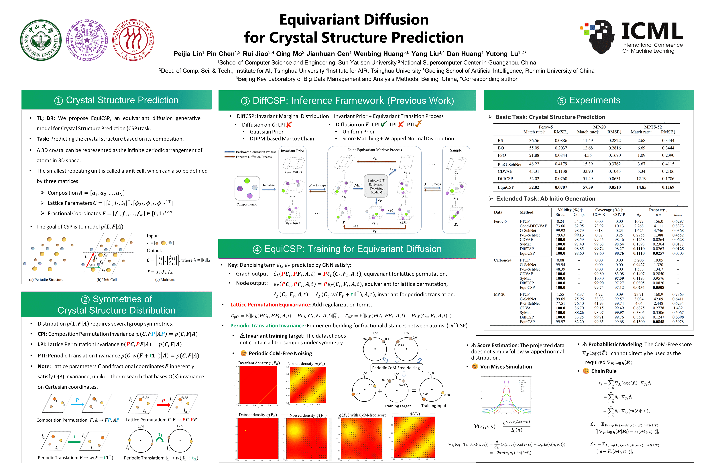

# Equivariant Diffusion for Crystal Structure Prediction (ICML 2024)

Implementation codes for Equivariant Diffusion for Crystal Structure Prediction (EquiCSP). 

[](https://github.com/EmperorJia/EquiCSP/blob/main/LICENSE)   [**[Paper]**](https://icml.cc/virtual/2024/poster/33915)



### Dependencies and Setup

```
python==3.8.13
torch==1.9.0
torch-geometric==2.2.0
torchmetrics==0.5.0
pytorch_lightning==1.3.8
pymatgen==2023.8.10
```

Rename the `.env.template` file into `.env` and specify the following variables.

```
PROJECT_ROOT: the absolute path of this repo
HYDRA_JOBS: the absolute path to save hydra outputs
WABDB_DIR: the absolute path to save wabdb outputs
```

### Training

For the CSP task

```
python equicsp/run.py data=<dataset> diffusion_target=equicsp.pl_modules.diffusion.CSPDiffusion expname=<expname> 
```

For the Ab Initio Generation task

```
python equicsp/run.py data=<dataset> diffusion_target=equicsp.pl_modules.diffusion_w_type.CSPDiffusion expname=<expname>
```

The ``<dataset>`` tag can be selected from perov_5, mp_20, mpts_52 and carbon_24, and the ``<expname>`` tag can be an arbitrary name to identify each experiment. Pre-trained checkpoints are provided [here](https://drive.google.com/drive/folders/1Dw945rCLCT3jbQ8FZsAxCCVMjeo-PByc?usp=drive_link).

Specifically, for the CSP task on the mpts_52 dataset, we made a slight modification to the output layer of the denoiser to achieve better training results. The modification involves adding the mean of the output layer node features to the node features themselves to form the new node features. You can use this denoiser with the following command:

```
python equicsp/run.py data=mpts_52 diffusion_target=equicsp.pl_modules.diffusion.CSPDiffusion cspnet_target=equicsp.pl_modules.cspnet_v3.CSPNet expname=<expname>
```

### Evaluation

#### Stable structure prediction 

One sample for each formula

```
python scripts/evaluate.py --model_path <model_path>
python scripts/compute_metrics.py --root_path <model_path> --tasks csp --gt_file data/<dataset>/test.csv 
```

#### Ab initio generation

```
python scripts/generation.py --model_path <model_path> --dataset <dataset>
python scripts/compute_metrics.py --root_path <model_path> --tasks gen --gt_file data/<dataset>/test.csv
```


#### Sample from arbitrary composition

```
python scripts/sample.py --model_path <model_path> --save_path <save_path> --formula <formula> --num_evals <num_evals>
```

### Acknowledgments

The main framework of this codebase is build upon [CDVAE](https://github.com/txie-93/cdvae) and [DiffCSP](https://github.com/jiaor17/DiffCSP). For the datasets, Perov-5, Carbon-24 and MP-20 are from [CDVAE](https://github.com/txie-93/cdvae), and MPTS-52 is collected from its original [codebase](https://github.com/sparks-baird/mp-time-split).

### Citation

Please consider citing our work if you find it helpful:
```
@InProceedings{lin2024equicsp,
  title={Equivariant Diffusion for Crystal Structure Prediction},
  author={Lin, Peijia and Chen, Pin and Jiao, Rui and Mo, Qing and Jianhuan, Cen and Huang, Wenbing and Liu, Yang and Huang, Dan and Lu, Yutong},
  booktitle={Proceedings of the 41st International Conference on Machine Learning},
  pages={29890--29913},
  year={2024}
}

```

### Contact

If you have any questions, feel free to reach us at:

Peijia Lin: [linpj6@mail2.sysu.edu.cn](mailto:linpj6@mail2.sysu.edu.cn)